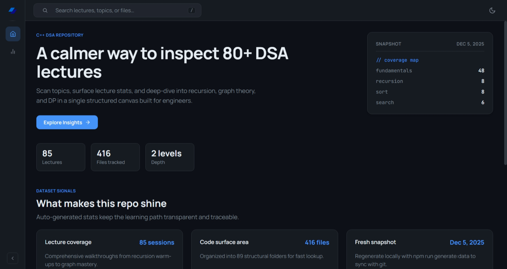

# C++ DSA Showcase Web App

Immersive single-page web application that celebrates the breadth of the C++ DSA learning repository. Built with Vite, modern vanilla JavaScript, and a feature-sliced architecture for maintainability.



## ✨ Highlights

- **Interactive explorer:** Collapsible tree to browse lectures and assets quickly.
- **Insightful dashboard:** Live statistics spotlighting coverage and keyword trends.
- **Fast search:** Instant filtering with keyboard shortcut (`/`) and highlighted matches.
- **Dynamic theming:** Light/dark mode respecting system preference with smooth toggles.
- **Static-first:** Zero backend; data generated from the repository tree via script.

## 🧰 Prerequisites

- Node.js 18+ (ships with npm)

## 🧱 Project Structure

```
frontend/
├── public/
│   ├── data/           # Generated dataset (codebase.json)
│   ├── hero.png        # Hero image used in docs/screenshots
│   └── sample.png      # Additional media asset
├── scripts/
│   └── generate-codebase-data.mjs
├── src/
│   ├── assets/
│   ├── components/
│   ├── features/
│   ├── pages/
│   ├── shared/
│   ├── widgets/
│   ├── styles.css
│   ├── App.jsx
│   └── main.jsx
├── index.html
├── package.json
├── package-lock.json
├── vite.config.js
└── vitest.setup.js
```

## 🚀 Quickstart

1. **Install dependencies**
   ```powershell
   npm install
   ```
2. **Generate dataset**
   ```powershell
   npm run generate:data
   ```
3. **Start development server**
   ```powershell
   npm run dev
   ```
4. Open [`http://localhost:5173`](http://localhost:5173) to explore the showcase.

## 📦 Scripts

| Command | Description |
| --- | --- |
| `npm run dev` | Start Vite dev server |
| `npm run build` | Bundle production build |
| `npm run preview` | Preview production build |
| `npm run test` | Run Vitest suite once |
| `npm run test:watch` | Run Vitest in watch mode |
| `npm run lint` | Lint source files |
| `npm run format` | Prettier formatting |
| `npm run generate:data` | Rebuild static dataset |

## 🧪 Testing

Vitest is preconfigured with JSDOM environment. Place tests alongside modules using the `.test.js` suffix. Example skeleton:

```js
import { describe, it, expect } from 'vitest';

import { filterTree } from '../shared/lib/search.js';

describe('filterTree', () => {
  it('filters nodes', () => {
    expect(filterTree([{ name: 'LEC-01', children: [] }], 'lec')).toHaveLength(1);
  });
});
```

Run with:

```powershell
npm run test
```

## 🔁 Dataset Regeneration

The explorer reads from `public/data/codebase.json`. Refresh the dataset whenever repository contents change.

```powershell
npm run generate:data
```

> **Note:** Dataset generation excludes the `frontend` directory to avoid recursion.

## 🔧 Troubleshooting

- **Missing dataset warning?** Run `npm run generate:data` to regenerate `public/data/codebase.json` after pulling new repository changes.

## 🛠️ Tech Stack

- [Vite](https://vitejs.dev/) – lightning-fast bundler
- React.js – component-based UI library
- CSS custom properties, grids, flexbox for layout and theming
- Vitest + JSDOM – testing environment

## 📄 License

This project inherits the repository license located at the root `LICENCE` file.
